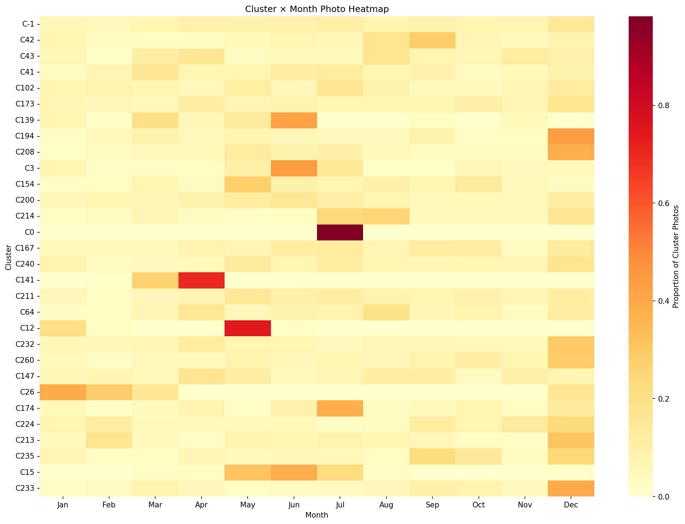
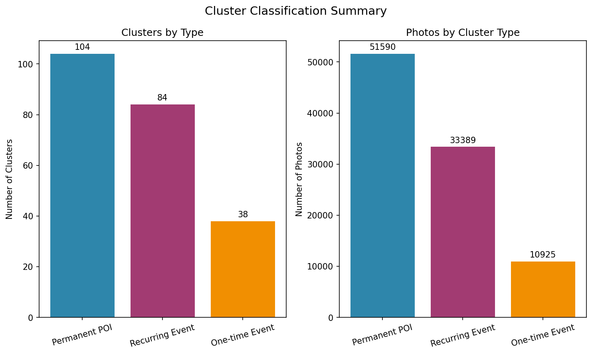
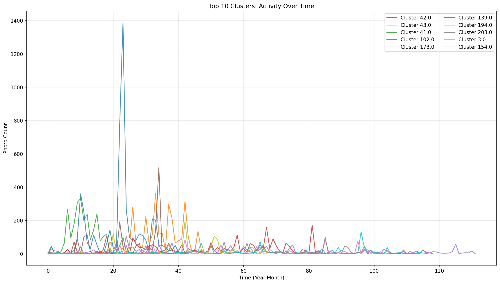
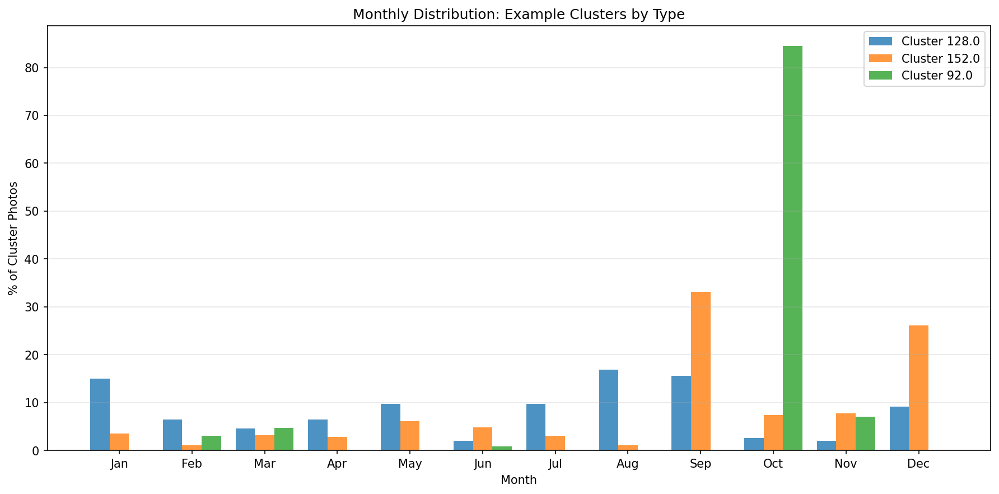

# Temporal Analysis Report

**Generated:** 2026-02-02 13:03:31  
**Total Clusters Analyzed:** 277  
**Total Photos:** 95,637.0

---

## Summary

This analysis classifies photo clusters based on their temporal patterns to distinguish between:

- **Permanent POIs**: Consistent year-round activity (e.g., landmarks, museums)
- **Recurring Events**: Seasonal patterns (e.g., Fête des Lumières, summer tourism)
- **One-time Events**: Single spike of activity (e.g., concerts, sports events)

### Classification Results

| Type | Clusters | Photos | % of Photos |
|------|----------|--------|-------------|
| **Permanent POI** | 111 | 49,348.0 | 51.6% |
| **Recurring Event** | 112 | 33,311.0 | 34.8% |
| **One-time Event** | 54 | 12,978.0 | 13.6% |

---

## Key Findings

### December Spikes (Fête des Lumières Candidates)

The following clusters show strong December activity:

| Cluster | December Ratio | Total Photos |
|---------|---------------|--------------|
| 159.0 | 99.0% | 103.0 |
| 40.0 | 94.5% | 128.0 |
| 38.0 | 94.2% | 225.0 |
| 271.0 | 90.4% | 115.0 |
| 267.0 | 86.1% | 288.0 |
| 275.0 | 84.8% | 125.0 |
| 103.0 | 84.3% | 216.0 |
| 160.0 | 82.3% | 130.0 |
| 228.0 | 81.0% | 168.0 |
| 261.0 | 70.0% | 120.0 |

### Summer Peaks (Tourism/Festival Candidates)

The following clusters show strong July-August activity:

| Cluster | Summer Ratio | Total Photos |
|---------|-------------|--------------|
| 35.0 | 100.0% | 180.0 |
| 36.0 | 100.0% | 359.0 |
| 47.0 | 100.0% | 191.0 |
| 0.0 | 98.3% | 884.0 |
| 272.0 | 91.5% | 106.0 |
| 7.0 | 88.7% | 142.0 |
| 178.0 | 88.5% | 130.0 |
| 72.0 | 87.7% | 114.0 |
| 23.0 | 80.1% | 196.0 |
| 127.0 | 79.5% | 156.0 |

---

## Visualizations

### Cluster × Month Heatmap

The heatmap below shows the normalized monthly distribution for the top 30 clusters:

### Classification Summary

### Time Series: Top 10 Clusters

### Monthly Distribution by Type

---

## Methodology

### Classification Rules

1. **Recurring Events** are identified when:
   - December ratio > 25% (Fête des Lumières pattern)
   - Summer ratio > 35% (tourism pattern)
   - High coefficient of variation (CV > 1.0) with clear peak

2. **One-time Events** are identified when:
   - Peak month contains > 50% of photos
   - Activity in 3 or fewer months

3. **Permanent POIs** are the default when:
   - Coefficient of variation < 0.8
   - Activity in 6+ months
   - Multi-year presence (5+ years)

### Peak Detection

Z-score based peak detection identifies months with activity more than 1.5 standard deviations above the mean.

---

## Known Lyon Events Reference

| Event | Months | Description |
|-------|--------|-------------|
| Fête des Lumières | December | Annual light festival |
| Nuits de Fourvière | June-July | Summer arts festival |
| Biennale de la Danse | September | Biennial dance festival |
| Quais du Polar | April | Crime fiction festival |
| Summer Tourism | July-August | Peak tourist season |
